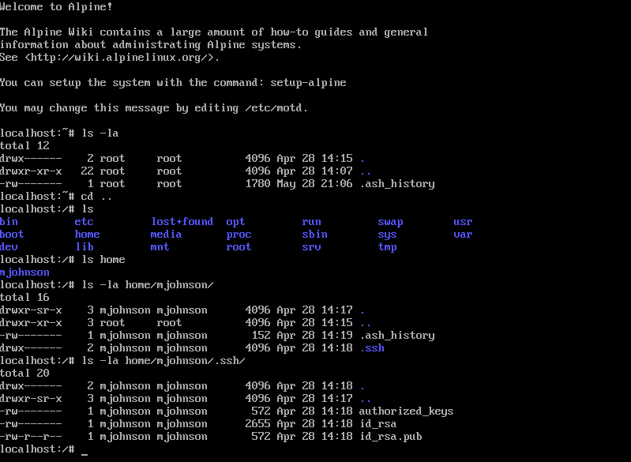

# Alpine 1 - 50
#### steg - [BYUCTF](../main.md)

## Challenge description:
> In this challenge you need to find the file and its path that is giving access to the attacker. The system administrator (root:strongpassword) created a user for a local user, Matt Johnson (mjohnson:hardpassword). An attacker was able to brute force Matt's password and login. The system administrator changed Matt's password (mjohnson:secretpassword), however the attacker is still able to SSH into the machine.
> 
> Provide the path and file name that is allowing the attacker to still have access (persistence): byuctf{/full/path/to/file}.
> 
> https://app.box.com/s/mi71hnua1osbnaludkxvmnbj1p65bi66/file/951434445088
> 
> Mirror download: https://drive.google.com/file/d/1lEnawSgZicsmf8UR7yn8reHzK7NQt4Bv/view?usp=sharing

## Solution
We are given a Alpine Linux image, and told an attacker is able to login to the account `mjohnson` despite the password being changed. We can login to the `root` account and go to the `.ssh` folder for `mjohnson` to investigate.

Here, we see an `authorized_keys` file. This would allow an attacker to login despite changed credentials.

 
    
Flag

byuctf{/home/mjohnson/.ssh/authorized_keys}
