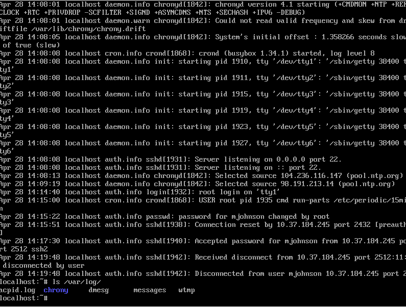

# Alpine 2 - 50
#### steg - [BYUCTF](../main.md)

## Challenge description:
> What was the IP address of the attacker? (Note: Matt Johnson never logged in remotely.)
>
> Flag format - byuctf{ip_address}
> 
> https://app.box.com/s/mi71hnua1osbnaludkxvmnbj1p65bi66/file/951434445088
> 
> Mirror download: https://drive.google.com/file/d/1lEnawSgZicsmf8UR7yn8reHzK7NQt4Bv/view?usp=sharing


## Solution
We again have the Alpine image and are told to find the IP address of the attacker. Our best bet is likely the log files in `/var/log/`.
```
localhost:~# ls /var/log/
acpid.log  chrony   dmesg   messages   wtmp
```
Reading them all with `less`, the `messages` file was the jackpot.

We see the IP address of the connection.

<details> 
    <summary>Flag</summary>
byuctf{10.37.184.245}
</details>