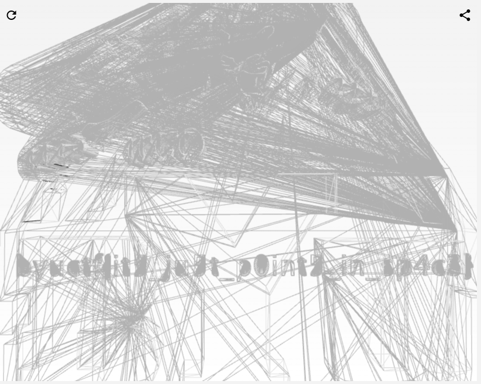

# Banana Smoothie - 349
#### steg - [BYUCTF](../main.md)

## Challenge description:
> I found this flag on the CTF admin's computer, so I figured I'd just give it to you. The only problem is that it's not opening for me...
> 
> Download file: [flag.png](../assets/banana-smoothie-flag.png)

## Solution
We are given an image. However, trying to open it doesn't work, as we get an error message saying its not an image file.

Running the `file` command tells us its just ASCII text, so I looked at the top of the file with `less` to understand what it was.

```
# This file uses centimeters as units for non-parametric coordinates.

mtllib byu2.mtl
g default
v 58.987507 100.245819 0.000000
v 58.975491 100.253433 0.000000
v 58.942921 100.276283 0.000000
v 58.895039 100.314445 0.000000
v 58.837074 100.367950 0.000000
v 58.805000 100.398651 0.000000
v 58.768661 100.430710 0.000000
v 58.729481 100.465256 0.000000
v 58.688873 100.503433 0.000000
v 58.837074 100.123642 0.000000
v 58.932156 99.866028 0.000000
v 63.334499 106.648544 0.011159
...
```

Googling mtllib .mtl, I found its characteristic of .obj files. I converted the file extension to .obj and went on the hunt for a 3d file viewer. Trying a few different ones, I found [this one](https://www.creators3d.com/online-viewer) with the option to view as wireframe. 

This allows you to look inside the 3d model, where the flag is hidden.

<details> 
    <summary>Flag</summary>
byuctf{it5_ju5t_p0int5_in_sp4c3}
</details>