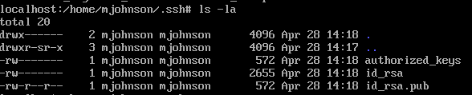

# Alpine 3
#### steg - [BYUCTF](../main.md)

## Challenge description:
> What was the date of the attack?
>
> Flag format - byuctf{mmm dd} (ie byuctf{jan 01})
> 
> Mirror download: https://drive.google.com/file/d/1lEnawSgZicsmf8UR7yn8reHzK7NQt4Bv/view?usp=sharing

## Solution
Back in the `.ssh` folder referenced in Alpine 1, we can use `ls -la` to see when the files were modified.

 
    
Flag

byuctf{apr 28}
